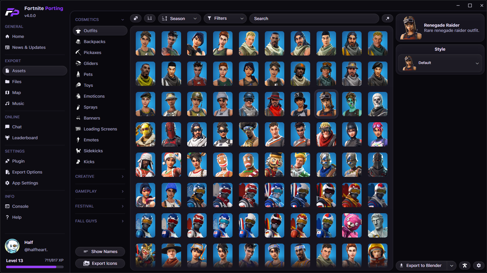

<div align="center">

# FortnitePorting
### The quickest and most efficient way to extract assets from Fortnite

#### Powered by [Avalonia UI](https://avaloniaui.net/) and [CUE4Parse](https://github.com/FabianFG/CUE4Parse)

[](https://discord.gg/DZ5YFXdBA6)
[](https://www.blender.org/download/)
[](https://www.unrealengine.com/en-US/download)
[]()
[]()



</div>

---

## Installation

Download the latest release from [Releases](../../releases/latest), the [Discord Server](https://discord.gg/fortniteporting), or the [Website](https://fortniteporting.app).

> [!IMPORTANT]
> FortnitePorting requires separate plugins to be installed for **Blender** and **Unreal Engine**. Plugin installation is managed directly within the app in the **Plugin** page.

---

## Building from Source

Clone the repository along with all submodules:

```
git clone https://github.com/h4lfheart/FortnitePorting --recursive
```

Then publish from the project directory:

```
dotnet publish FortnitePorting -c Release --self-contained -r win-x64 -o "./Release" -p:PublishSingleFile=true -p:DebugType=None -p:DebugSymbols=false -p:IncludeNativeLibrariesForSelfExtract=true
```

> [!NOTE]
> FortnitePorting currently only targets Windows x64. Ensure you have the [.NET SDK](https://dotnet.microsoft.com/en-us/download) installed before building.

---

## Contributors

[Chippy](https://github.com/Bmarquez1997) - Has done some incredible work on the new material system and exporting features overall.

[Ghost](https://github.com/GhostScissors) - Super helpful with implementing the two built-in RADA and BINKA audio decoders along with fixing tons of asset deserialization issues caused by engine changes.

[Asval](https://github.com/4sval) - An incredible inspiration for tools like Fortnite Porting and main contributor to the [CUE4Parse](https://github.com/FabianFG/CUE4Parse) project.

[GMatrix](https://github.com/GMatrixGames) - Has consistently been hosting AES keys and Mappings through the UEDB project that are utilized every day by Fortnite Porting.

[Marcel](https://github.com/Ka1serM) - Helped out with the Unreal plugins for Fortnite Porting and UEFormat along with tons of world/level export features and inspiration.

[MountainFlash](https://github.com/MinshuG) - Inspiration for a lot of the automation in the Fortnite Porting project when it was first being developed.

[RedHaze](https://github.com/RedHaze) - Added support for proper Pose Asset processing and laid the groundwork for full pose asset exporting with UEFormat.

...And many other people as there have been tons of contributors throughout the lifetime of Fortnite Porting!!
